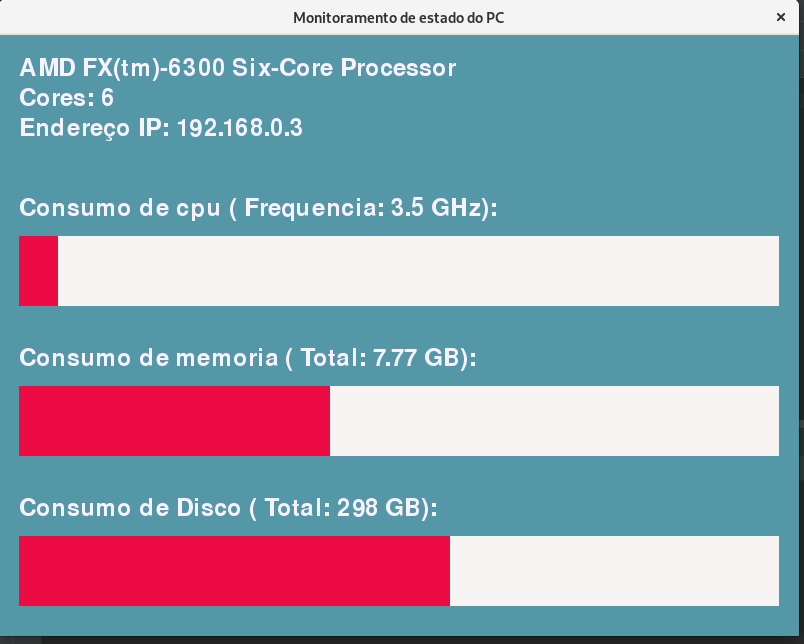

# projeto_arquitetura_pc
 
 Projeto para o curso de Análise e desenvolvimento de sistemas do Instituto Infnet, com o intuito de explorar conceitos de hardware e uso de monitoramento ao vivo.
 
### Descrição
 
 Aplicação para monitoramento e captação de informações do hardware. Basicamente a aplicação
obtêm informações do sistema operacional, e para isso foi proposto o uso das bibliotecas psutil e
cpuinfo.
 
### Ferramentas
 
 * python 3.7
 * biblioteca Pygame
 * bibiblioteca cpuinfo
 * biblioteca psutil

### Imagens

 
 
### Detalhes
 
 A psutil é uma biblioteca que possui funções e objetos que fornecem informações do
hardware. Informações podendo ser a temperatura, uso de memoria, cpu, disco, ou mesmo a
arquitetura do processador .Geralmente essas informações são trazidas no formato de dicionários e
tuplas (como funções cpu_times, virtual_memory, etc ), além de strings e valores reais(cpu_count,
cpu_percent).

A cpuinfo é outra biblioteca que recolhe dados sobre o processador e retorna-os em
dicionários, do qual podemos obter informações diretas e específicas sobre um aspecto do próprio
do processador.

Também foi criada uma interface interativa para o uso do terminal. Seu principal uso foi
para teste de módulos e para uma execução mais simples.

 
### Suporte

Para sistemas linux os dados do modelo foi obtido de um arquivo do sistema
operacional, enquanto que a arquitetura a própria psutil forneceu essa informação. Mas nas
mudanças finais cpuinfo se mostrou uma opção melhor devido a não necessidade da verificação do
sistema operacional e seu acesso por chave ser simples.

Informações de disco (HD, ssd) também são obtidas de forma diferente em linux, e isso se
manteve até o fim do projeto, para tal o tipo do sistema do usuário levado em consideração para
determinar informações de disco. Sendo linux foi somado os valores de espaço obtidos me root e
usuário regular. Sistemas linux, geralmente dividem o sistema em duas partições, uma para root
outra para o home onde ficam todos as contas regulares, o espaço de disco em home é obtido da
usuário corrente “.”, contudo root é obtido “/”, da raiz do sistemas de arquivos. Contudo não
estamos considerando o uso da aplicação em modo root. 

> A aplicação no presente momento foi
pensada para uso em sistemas linux e windows.